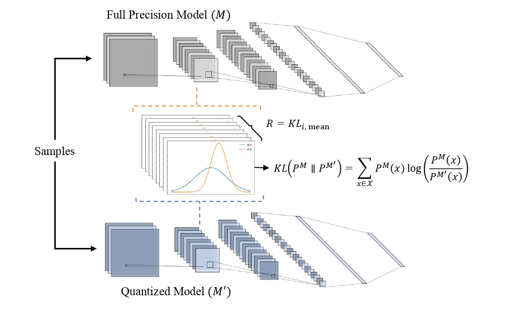

# Systematic Mixed-Precision Post-Training Quantization Based on KL Divergence

In this paper, we propose a systematic quantization framework based on Kullback-Leibler (KL) divergence to automatically allocate the optimal bit-width sequence used for DNN quantization. This sequence is allocated through a two-stage process using Deep Reinforcement Learning (DRL) and optimization-based approaches. In the first stage, we utilize the probabilistic nature of the Soft Actor-Critic (SAC) DRL approach to search for the optimal bit-width combination required to quantize the weights and activations in a layer-wise manner and compare its learning performance with the Deep Deterministic Policy Gradient approach (DDPG). As we employ the Post-Training Quantization (PTQ) strategy in our work, we aim to preserve the internal characteristics of the DNN model by including the KL divergence distance within the DRL reward component. In the second stage, we quantize the weights in a channel-wise fashion using an optimization-based technique that aims to minimize the KL divergence between the full-precision and quantized model activations. The proposed two-stage framework is novel, and our experiments demonstrate that it achieves better results than other recent PTQ works by reducing the network size while maintaining accuracy. Specifically, the method yields up to 9.5x and 8.9x compression compared to the full-precision models on ResNet-18 and ResNet-34, respectively, while preserving the internal model characteristics by minimizing the KL distance between the activations of the baseline and quantized models.

## License

This project is licensed under the [MIT License](LICENSE).
